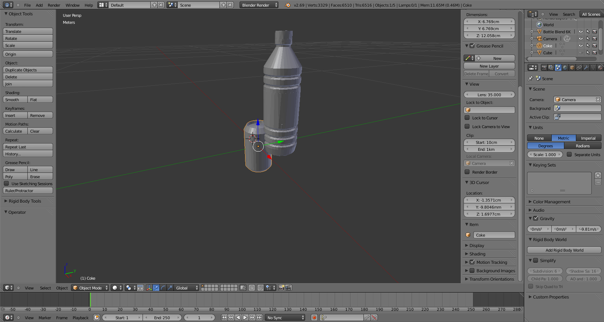
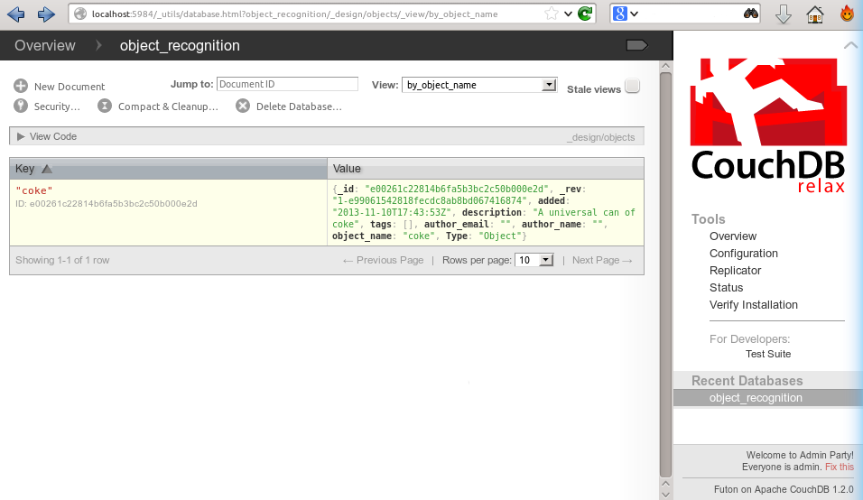
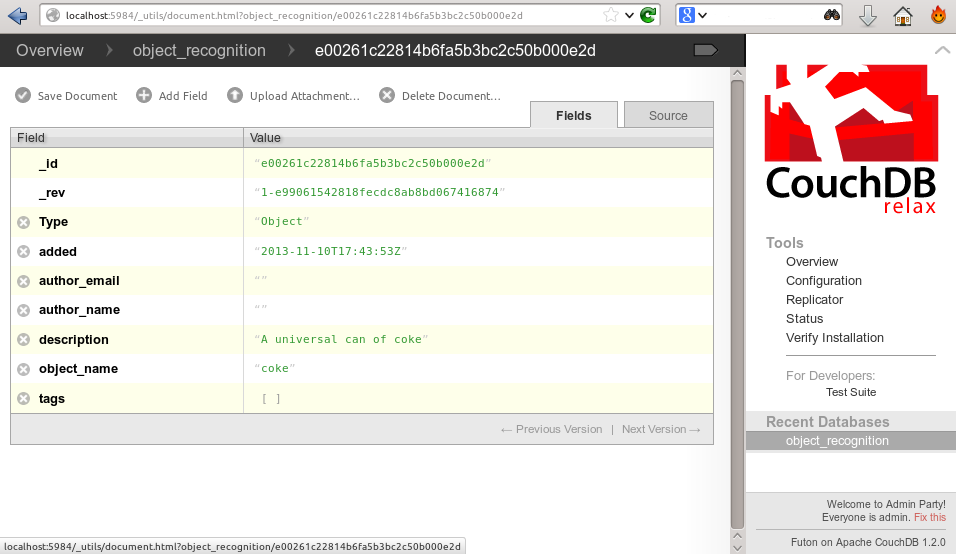
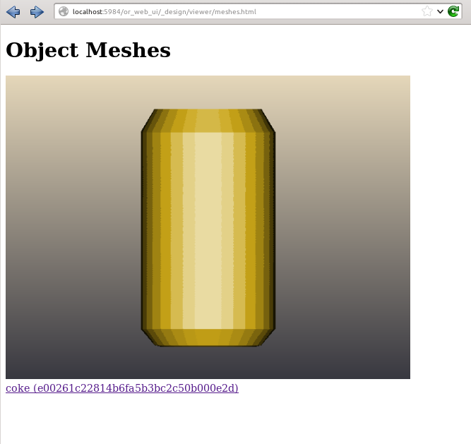

.. _tutorial01:

Object Recognition DB
#####################

In the Object Recognition Kitchen, everything is stored in a database: objects, models, training data. We'll walk you through the basics of the DB in this tutorial, you will:

   * preparing object's mesh to add to the DB
   * learn how to manually add an object to the DB
   * visualize data in the ``ORK`` DB

Introduction
************

Make sure you followed the steps in the core :ref:`DB instructions <orkcore:object_recognition_core_db>`, especially to get the 3d visualizer in the DB.

The example we will use is a can of Coke as it's somewhat universal :) For real life experiments, just get the iconic red can and there should not be too many appearance changes.

Prepare object's mesh
*********************
Object's mesh is important for object detection in ORK. Object's mesh must be in format .stl/obj.

You can prepare your object's mesh by following the ORK's capture procedure (very well explained in Quick Guide). Otherwise, you can use any software that allows mesh creation to prepare your mesh. Or you can use meshes that are free on the internet.

Once you have your mesh, make sure it have the right size and note it's origin point before you upload it onto the DB. As in the following snapshot of blender's screen, you can see that the coke's mesh has a different position to the origin point than the bottle's mesh.

   
In ORK, object's position returned by ORK is the position of the origin point of the object's mesh.

Creating an object in the DB
****************************

ORK is about recognizing objects so you need to store objects in the DB first. Some pipelines like :ref:`ORK 3d capture <orkcapture:ork_capture>` have an interface to create those for you. But you can also do it with the scripts from the core.

.. toggle_table::
   :arg1: Non-ROS
   :arg2: ROS

.. toggle:: Non-ROS

   .. code-block:: sh
   
      ./ork_core/apps/dbscripts/object_add.py -n coke -d "A universal can of coke"
   
.. toggle:: ROS

   .. code-block:: sh
   
      rosrun object_recognition_core object_add.py -n coke -d "A universal can of coke"

You can then check this object in the DB by going to http://localhost:5984/_utils/database.html?object_recognition/_design/objects/_view/by_object_name

If you click on it, you can see the info you entered about the object, especially the object id:

Manually adding a mesh for the object
*************************************

First, check out the object id of your object using the DB interface: each element of the DB (objects included) has its own hash as a unique identifier (in case you give the same name to different objects) and that is how you should refer to objects. To upload the mesh (use an .stl/.obj one):

.. toggle_table::
   :arg1: Non-ROS
   :arg2: ROS

.. toggle:: Non-ROS

   .. code-block:: sh
   
      ./ork_core/apps/dbscripts/mesh_add.py YOUR_OBJECT_ID YOUR_COKE_BLEND_PATH --commit

.. toggle:: ROS

   .. code-block:: sh
   
      rosrun object_recognition_core mesh_add.py YOUR_OBJECT_ID `rospack find object_recognition_tutorials`/data/coke.obj --commit

Visualizing the object
**********************

Now, if you want to visualize the object in the db, you can just go to the visualization URL at http://localhost:5984/or_web_ui/_design/viewer/meshes.html and you should see the following:

Deleting an object
******************

You also have a method to delete an object (it will delete all other elements in the database like models/training data from it too).

.. toggle_table::
   :arg1: Non-ROS
   :arg2: ROS
   
.. toggle:: Non-ROS

   .. code-block:: sh

      ./ork_core/apps/dbscripts/object_delete.py OBJECT_ID

.. toggle:: ROS

   .. code-block:: sh

      rosrun object_recognition_core object_delete.py OBJECT_ID
