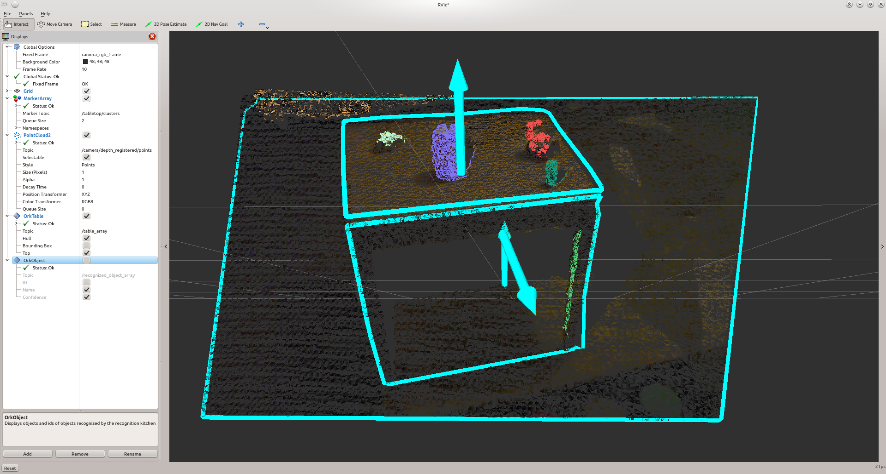
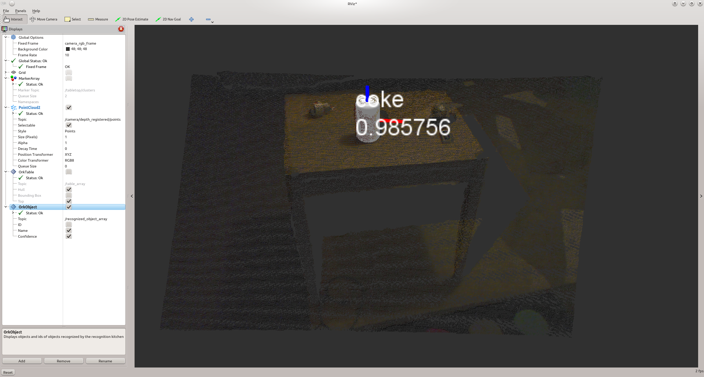

.. _tutorial02:

Object Recognition Using Tabletop
#################################

:ref:`Tabletop <orktabletop:tabletop>` is a simple pipeline for object recognition that only requires the mesh of an object for training/detection.

Through this tutorial, you will:

   * learn how to use the ``tabletop`` pipeline to find planes
   * learn how to use the ``tabletop`` pipeline to find certain kinds of objects
   * use the ``ORK`` RViz plugins

Let's first set up the working environment together!

Setup the working environment
*****************************

Hardware
========

To see tabletop in action, we will need to have
  * a 3D camera (such as a Kinect, a Xtion),
  * a computer that can run ROS
  * some plane surfaces (such as a table, a wall, or the ground under your feet ;-) )
  * and optionally, some COKE can if you want to test the object detection feature of ORK_tabletop :-)

Software
========

We need to have ORK installed on the computer. Installation of ORK is quite easy and clearly explained in :ref:`here <orkcore:install>`. We need ``rqt_reconfigure`` and ``RViz`` to configure the 3D camera and visualize the detected planes and objects. To install those tools, just run the following command:

.. code-block:: sh

    sudo apt-get install ros-<your ROS distro>-rviz ros-<your ROS distro>-rqt_reconfigure ros-<your ROS distro>-openni*

Configuring the 3D camera and ``RViz`` parameters
=================================================

In separate terminals, run the following commands:

.. code-block:: sh

    roslaunch openni2_launch openni2.launch
    rosrun rviz rviz
    
Set the Fixed Frame (top left of the ``RViz`` window) to ``/camera_depth_optical_frame``. Add a PointCloud2 display, and set the topic to ``/camera/depth/points``. Turning the background to light gray can help with viewing. This is the unregistered point cloud in the frame of the depth (IR) camera. It is not matched with the RGB camera images. Now let's look at a registered point cloud, aligned with the RGB data. Open the dynamic reconfigure GUI:

.. code-block:: sh

    rosrun rqt_reconfigure rqt_reconfigure
    
And select ``/camera/driver`` from the drop-down menu. Enable the ``depth_registration`` checkbox. Now go back to ``RViz``, and change your PointCloud2 topic to ``/camera/depth_registered/points``. Set Color Transformer to RGB8. You should see a color, 3D point cloud of your scene.

(Detailed explanation can be found here: http://wiki.ros.org/openni2_launch)

Finding planes
**************

In order to find planes using ORK_Tabletop, run the following command:

.. code-block:: sh

    rosrun object_recognition_core detection -c `rospack find object_recognition_tabletop`/conf/detection.table.ros.ork
    
Then go to ``RViz`` graphical window, and add the OrkTable display. Now you should see some planes detected by ORK_Tabletop if your camera is pointing to some plane surfaces.

Finding objects
***************

If you follow the installation guide (http://wg-perception.github.io/object_recognition_core/install.html#install), you know that ORK uses couchDB to manage the objects database. In order to have tabletop detect objects, we need to feed the databases with objects' 3D models.

When you first installed ORK, my database was empty. Luckily, ork tutorials comes with 3D model of a coke can. So, download the tutorials:

.. code-block:: sh

    git clone https://github.com/wg-perception/ork_tutorials

then uploaded it to the ORK database:

.. code-block:: sh

    rosrun object_recognition_core object_add.py -n "coke " -d "A universal can of coke"
    rosrun object_recognition_core mesh_add.py <the object id that previous command returned> <path to the ork_tutorials/data/coke.stl>

If you also did these steps to upload objects, then when opening the link http://localhost:5984/or_web_ui/_design/viewer/objects.html you should see the coke object listed in your database.

As everything is set up; let's see how ork_tabletop detects our coke can. In a terminal, run

.. code-block:: sh

    rosrun object_recognition_core detection -c  `rospack find object_recognition_tabletop`/conf/detection.object.ros.ork
    
Go back to ``RViz`` , and add the ``OrkObject`` display. Now if you have a coke can placed on one of the detected planes, ork_tabletop should see it and your beautiful ``RViz`` interface should be displaying it, like this:

**Notice:** In the image, you only see the coke because OrkTable is unchecked in ``RViz`` interface. This should not be the case on your beautiful ``RViz`` unless you actually uncheck that box ;-)

A video resuming these steps can be found `here <http://youtu.be/b_Ti3_4gY1I>`_.

F.A.Q.
******

**Problem:** ORK_tabletop complained about the 3D inputs or seems to wait for ROS topic forever. Why?

**Answer:** That happened to me a couple of times, too. That may be because ORK_Tabletop is not listening to the topics that the 3D camera is publishing. Just open the configuration file called in the detection command and check if the default topics are the same as what are published by the 3D camera. If that's not the case, just uncomment the parameter option and modify these topics accordingly. And hopefully, tabletop would be happy with this modification and show off its power the next time you run it.

**Problem:** When running the tabletop detection command, you run into the below exception message. How to fix it?::

  /usr/include/boost/smart_ptr/shared_ptr.hpp:412: boost::shared_ptr<T>::reference boost::shared_ptr<T>::operator*() const [with T = xn::NodeInfo, boost::shared_ptr<T>::reference = xn::NodeInfo&]: Assertion `px != 0' failed

**Answer:** This means that tabletop receives no messages from one (or several) ROS topics that it subscribes as input. When you run into this exception, please verify if those ROS topics is publishing messages as expected (tips: use 'rostopic echo <ROS_topic_name>) and then relaunch your tabletop pipeline.

Now that you see things on the ``RViz``, why don't you just move the 3D camera around to see how fast ORK_tabletop detects thing? ;-)

Have fun exploring!
