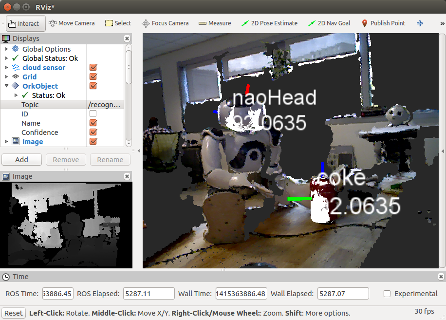
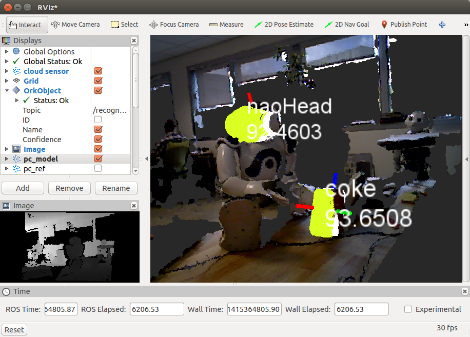

.. _tutorial03:

Object Recognition Using Linemod
#################################

:ref:`Linemod <orklinemod:line_mod>` is a pipeline that implements one of the best methods for generic rigid object recognition and it proceeds using very fast template matching. For more information, check the LINE-MOD approach from http://ar.in.tum.de/Main/StefanHinterstoisser.

Through this tutorial, you will:

   * learn how to use the ``linemod`` pipeline to learn objects
   * learn how to use the ``linemod`` pipeline to detect objects
   * use the ``ORK`` RViz plugins

Setup the working environment
*****************************

Hardware
========

To see Linemod in action, we will need to have
  * a 3D camera (such as a Kinect or a Xtion),
  * a PC with ROS installed,
  * and optionally, some CAN to test the object detection

Software
========

You need to have ORK installed on the computer. Installation of ORK is quite easy and clearly explained in :ref:`here <orkcore:install>`. We need ``rqt_reconfigure`` and ``RViz`` to configure the 3D camera and visualize the detected objects. To install those tools, just run the following command:

.. code-block:: sh

    sudo apt-get install ros-<your ROS distro>-rviz ros-<your ROS distro>-rqt_reconfigure ros-<your ROS distro>-openni*

Configuring the 3D camera and ``RViz`` parameters
=================================================

At first, launch the OpenNI driver:

.. code-block:: sh

    roslaunch openni2_launch openni2.launch

Run RViz

.. code-block:: sh

    rosrun rviz rviz
    
Set the Fixed Frame (in Global Options, ``Displays`` window) to ``/camera_depth_optical_frame``. Add a PointCloud2 display and set the topic to ``/camera/depth/points``.  This is the unregistered point cloud in the frame of the depth (IR) camera and it is not matched with the RGB camera images. 
For visualization of the registered point cloud, the depth data could be aligned with the RGB data. To do it, launch the dynamic reconfigure GUI:

.. code-block:: sh

    rosrun rqt_reconfigure rqt_reconfigure
    
Select ``/camera/driver`` from the drop-down menu and enable the ``depth_registration`` checkbox.
In ``RViz``, change the PointCloud2 topic to ``/camera/depth_registered/points`` and set the Color Transformer to ``RGB8`` to see both color and 3D point cloud of your scene. 
The detailed explanation can be found here: http://wiki.ros.org/openni2_launch.

Object detection
****************

Setup the object database
=========================

The Object Recognition Kitchen manages objects using :ref:`couchDB <orkcore:object_recognition_core_db>` database. Thus, in order to learn objects, you need to store their 3D models in the database first. You can check the detailed :ref:`DB tutorial <orkcore:object_recognition_core_db>` or the following brief explanation.

When you install ORK, the database is empty. Luckily, ORK tutorials comes with a 3D mesh of a coke that can be downloaded here:

.. code-block:: sh

    git clone https://github.com/wg-perception/ork_tutorials

You can upload the object and its mesh to the database with the scripts from the core:

.. code-block:: sh

    rosrun object_recognition_core object_add.py -n "coke " -d "A universal can of coke"
    rosrun object_recognition_core mesh_add.py <YOUR_OBJECT_ID> <path to ork_tutorials/data/coke.stl>

Once uploaded, you can then check the object in the database by going to http://localhost:5984/_utils/database.html?object_recognition/_design/objects/_view/by_object_name

Training
========

Now, you can learn objects models from the database. Execute the Linemod in the training mode with the configuration file through the ``-c`` option. The configuration file should define a pipeline that reads data from the database and computes objects models.

.. code-block:: sh

    rosrun object_recognition_core training -c `rospack find object_recognition_linemod`/conf/training.ork

Detection
=========

Once learned, objects can be detected from the input point cloud. In order to detect object continuously, execute the Linemod in the detection mode with the configuration file that defines a source, a sink, and a pipeline, as explained in http://wg-perception.github.io/object_recognition_core/detection/detection.html.

.. code-block:: sh

    rosrun object_recognition_core detection -c  `rospack find object_recognition_linemod`/conf/detection.ros.ork

Visualization with RViz
=======================
    
Now, go to ``RViz`` and add the ``OrkObject`` in the ``Displays`` window. Select the ``OrkObject`` topic and the parameters to display: object id, name, and confidence. 
Here, we show an example of detecting two objects (a coke and a head of NAO) and the outcome visualized in RViz:

For each recognized object, you can visualize its point cloud and also a point cloud of the matching object from the database. For this, compile the package with the CMake option ``-DLINEMOD_VIZ_PCD=ON``.
Once an object is recognized, its point cloud from the sensor 3D data is visualized as shown in the following image (check blue color). The cloud is published under the ``/real_icpin_ref`` topic.

.. image:: Screenshot_pc_ref.png
   :width: 100%

For the same recognized object, we can visualize the point cloud of the matching object from the database as shown in the following image (check yellow color). The point cloud is created from the mesh stored in the database by visualizing at a pose returned by Linemod and refined by ICP. The cloud is published under the ``/real_icpin_model`` topic.

