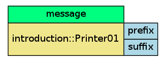

.. _cells-overview:

Cells
=====
The Cell is the core concept that one must grok to use ecto.  Think of a cell
as a small self contained well formed unit of processing machinery. Each cell's 
job is to take some number of inputs, and transform them into 
some number of outputs. Of course, parameters may have some effect on this
transformation, and cells may each have their own state that they alone govern.

Let us examine a c++ construct, a common functor:

.. _cell-Functor:

    .. literalinclude:: functor.cpp
	   :language: cpp
	   :start-after: //start
	   :end-before: //end
    
    A c++ function object.

Functors, function objects, are a reasonable way of encapsulating self contained
functionality to operate on a set of data, and mesh well with the stl algorithms.
The operator() may be abused by templated code to give way to genericity.

The ecto Cell is similar, in that it gives ecto a common unit with which to work.
Here is the ecto equivalent of the above functor, slightly more verbose of course:

.. _cell-Printer01:

  .. literalinclude:: cell.cpp
     :language: cpp
     :start-after: //start
     :end-before: //end
     
  A typical ``ecto::cell``.

The verbosity is a feature of ecto, in that each cell exposes as much information
as it can to the :ref:`ectosphere`.  At runtime, ecto may ask the cell
for documentation, types, and semantics.  These features are what enable
the type-safety in a graph of cells, or auto-completion from an :ref:`ipython context <ipython>`.

.. _examination-cell:

Examination of the Cell
-----------------------

A Cell defines some set of parameters, inputs and outputs statically.  And each cell
created from this static definition holds its own state, and may operate on it's
parameters,inputs and outputs at specific moments throughout it's lifetime. Also
the outside world may examine and manipulate the cells :ref:`tendrils`.

Let us look at a graphical representation of the Cell written :ref:`above <cell-Printer01>`:

   
   A graphical representation of a ``ecto::cell``.  In ``green`` are the inputs,
   ``blue`` parameters, ``yellow`` cell type. This cell has no outputs.

The parameters, inputs, and outputs of a cell all share the same type, :ref:`tendril-overview`.
Tendrils are mappings between strings, and lazily typed objects.  These are how the
cell communicates with the rest of the system.  The reason for choosing a runtime
typed object like the :ref:`tendril-overview` instead of a compile time typed object
like a ``boost::tuple`` is that it allows for ecto to be type ignorant, as the
data held by the tendril has really no effect on how a graph executes or the python
interfaces.  Ecto is a plugin based architecture, and so can not be header only,
strictly compile time typed.

Optional interface
^^^^^^^^^^^^^^^^^^

The most basic of cells would be:

  .. literalinclude:: nop.cpp
    :language: cpp
    :start-after: //start
    :end-before: //end

  .. ectocell:: ecto.ecto_overview NopCell

Each cell may or may not implement the following functions:

.. _interface_sample:

  .. literalinclude:: interface.cpp
     :language: cpp
     :start-after: //start
     :end-before: //end
     
  The cell interface functions.
  
.. sidebar:: A note on where to implement
  
  Notice that in most examples we implement the functions for cells inline in the declaration
  of the struct. However there is nothing stopping you from writing the implementation elsewhere.

However if you do implement any of the methods in the cell interface, be sure that
their signatures match the above specification.

A peek under the covers
^^^^^^^^^^^^^^^^^^^^^^^

.. epigraph::
  
  But wait, how does ecto know anything about my cell? You must be full of black magic!
  Where is the inheritence and polymorphism?
  
  -- Egon

You might be thinking these kinds of things... Well the registration with ecto occurs in the macro :c:macro:`ECTO_CELL`.
This macro
does some amount of extra fanciness, but in the end it takes your struct and does something similar
to the following simplified example:

.. code-block:: c++
  
  struct cell
  {
    virtual ~cell(){}
    virtual void declare_params() = 0;
    virtual int process() = 0;
    //... other interface functions
    ecto::tendrils params_, inputs_, outputs_;
  };

  template<typename YourCell>
  struct cell_ : cell
  {
    void declare_params()
    {
      YourCell::declare_params(params_);
    }
    
    void configure()
    {
      if(!thiz_)
      {
        thiz_ = new YourCell();
        thiz_->configure();
      }
    }
    //... dispatch other functions...
    YourCell* thiz_;
  }
  
  cell_<InterfaceCell> c;
  
.. _SFINAE: http://en.wikipedia.org/wiki/Substitution_failure_is_not_an_error

The real implementation uses `SFINAE`_ to enable
optional implementation of the interface functions.
The macro :c:macro:`ECTO_CELL` also constructs python
bindings for your cell, and
generates RST formated doc strings from the
static declaration parameter and io functions.
The above sample
should be referred to as the essence of the technique, rather than the exact
implementation.  This technique gives a certain amount of opaqueness to
the client cell implementers, and
provides ecto with a flexible entry point for implementation details.

Doing work
----------

Let us take the :ref:`Printer <cell-Printer01>` from above and use it from python. The following python
script demonstrates the python interface of our cell that ecto provides for free(assuming you used the macro and followed the cell interface).

.. literalinclude:: cell01.py
   :language: py

The script, when run will give the following output:

.. program-output:: ./cell01.py
  :in_srcdir:

Doc Generation
^^^^^^^^^^^^^^
Notice the line ``print Printer01.__doc__``, every ecto cell gets this for free
based on the docstrings that were written in the static declare_* functions.
This is a class level attribute, and is one of the justifications for having
the declare_* functions be static.  At import time, the ``__doc__`` strings are
generated, and it is important that you write cells that will **not** crash during
import.

Another cool aspect of documentation generation is its full integration into sphinx
docs. Placing the following command in sphinx::

  .. ectocell:: ecto.ecto_overview Printer01

Produces:

.. ectocell:: ecto.ecto_overview Printer01

Also from an interactive python prompt, the following should produce useful
output::
  
  >>> from ecto.ecto_overview import Printer01
  >>> help(Printer01)
  
For more detailed information, refer to :ref:`ectodoc`.

Cell construction
^^^^^^^^^^^^^^^^^

Let us take a closer look at the python sample code. Take the cell construction
line:

  .. literalinclude:: cell01.py
    :language: py
    :lines: 6
  
  A typical cell constructor call from python. Notice mapping from keyword
  arguments to the parameters declared in :ref:`Printer <cell-Printer01>`.
  
Every Cell gets a constructor that has the following python signature::
  
  Cell([Cell.type_name()], [param1=...],[param2=...])

.. sidebar:: When is configure called?
  
  Your cell is not actually allocated(constructed) until a call to process or right before
  a scheduler executes your processing graph, see :ref:`schedulers`.
  
  This is important, as python may be used to quickly iterate on your processing graph
  structure, and heavy allocation (and possible crashes) will be lazily evaluated
  when the Cell is actually used to do work.
  
  This may be abused for **documentation**, **prototyping**, and **GUI** applications.
  

The first optional non-keyword argument is the cell's instance name. The instance
name is useful for debug and graph display purposes.  Each parameter that was
declared by the cell may be initialized as a keyword argument.  Other advanced keyword arguments
may exist, that are defined by ecto, such as :ref:`strands`.

The constructor of the cell calls ``declare_params``, sets the cell's parameters
with any supplied by keyword arguments, then precedes to call ``declare_io``, with
the parameter values set by the keyword arguments.  It is important to note that
when the constructor returns a new cell, the constructor of the struct, e.g. ``Printer01``,
has not yet been called, also, configure has not yet been called.

Configuration and Processing
^^^^^^^^^^^^^^^^^^^^^^^^^^^^
.. sidebar:: If it has a boost::python binding, life is wonderful
  
  You may notice the assignment of a string to tendril from **python**, even though
  the tendril was declared with a **c++** type.  Its all good as long as you have
  boost::python bindings. See :ref:`tendril-conversions` for an explanation.
  
  If you **don't** have bindings, not to worry, you just won't be able to
  manipulate your tendrils from python... Oh and you get python bindings
  for free for all the basic types.
  
So even though we only have a shell of a cell, we can still manipulate its :ref:`tendrils`.
Lets set the input tendril, called `message`, to a custom string. Then we'll call
process.

  .. literalinclude:: cell01.py
    :language: py
    :lines: 8,10

Now, before the call to process our Printer01 hasn't actually been allocated,
but all of its tendrils, inputs, outputs, and parameters are accessible from python.
During the call to process, the Printer01 is allocated as necessary, the
configure function is called, any ``parameter-callbacks`` are triggered if
parameters have changed value, and then process is executed.

.. _cell-sketch-python-interface:

.. topic:: Cell Python Interface
  
  Every cell exposes a bit of functionality to python, which may be useful to
  know.
  
  .. py:class:: Cell
  
    A sketch of the cell python interface.
    
    .. py:attribute:: (Tendrils)parameters
      
      The parameters of the cell, initialized by the cell's constructor.
      
    .. py:attribute:: (Tendrils)inputs
      
      The inputs may be initialized with dependence on the parameters but are valid
      and free game in python.
      
    .. py:attribute:: (Tendrils)outputs
      
      Same as inputs.
    
    .. py:method:: configure()
    
      Allocates the underlying cell, say ``Printer01``, and dispatches configure.
      Will not have any effect the second time configure is called.
       
    .. py:method:: process()
    
      May call configure if it has not already been called. Dispatches a call to
      process in the underlying cell, e.g. ``Printer::process(...)``

Cell Life Cycle
---------------

The life cycle of cell is important to keep in mind.
  * ``declare_params`` and ``declare_io`` are static functions and will be called
    in order to initialize the cell's parameters,inputs, and outputs.
  * ``configure`` will be called once right after the construction of the
    cell.
  * ``process`` will be called any number of times, with parameter callbacks being triggered prior to its execution.
  * When all references to the cell are gone, i.e. it has gone out of scope, then it may be deleted.

.. graphviz::
    
    digraph cell_life_cycle
    {
      node [shape=rect];
      1 [label="CellT::declare_params(...)"];
      user [label="User sets params.",shape=parallelogram];
      2 [label="CellT::declare_io(...)"];
      3 [label="cell = new CellT()"];
      4 [label="cell->configure(...)"];
      5 [label="cell->process(...)"];
      8 [label="Parameters changed?", shape=diamond];
      6 [label="Notify change callbacks."];
      7 [label="delete cell"];
      
      1->user->2;
      2-> 3 ->4->8;
      
      8->6 [label="True"];
      6->5;
      8->5 [label="False"];
      5->8;
      5->7[label="exit scope"];
    }
